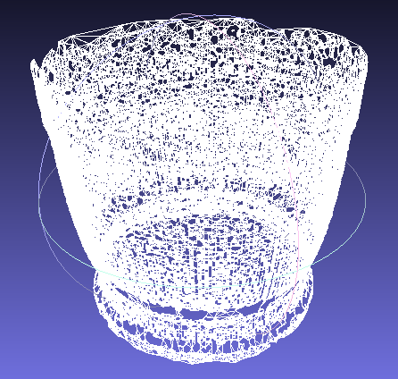

## Escaner3D-Grafica
Repositorio para el proyecto de escáner 3D basado en linea láser para el curso de Computación Grafica

## Integrantes

1. Tapia Rios, Aaron
2. Huamachuco Huacani, Romel
3. Hancco Tancayllo, Hetmith

## Resultados

### Objeto

Objeto de Porcelana Real

Reconstruccion 3D Porcelana

### Taza

Taza Real

Reconstruccion 3D Taza

